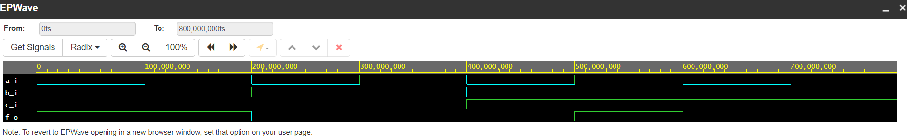

# CV1
## Task 1
| **c** | **b** |**a** | **f(c,b,a)** |
| :-: | :-: | :-: | :-: |
| 0 | 0 | 0 | 1 |
| 0 | 0 | 1 | 1 |
| 0 | 1 | 0 | 0 |
| 0 | 1 | 1 | 0 |
| 1 | 0 | 0 | 0 |
| 1 | 0 | 1 | 1 |
| 1 | 1 | 0 | 0 |
| 1 | 1 | 1 | 0 |

[My code here](https://www.edaplayground.com/x/gzeu)

```VHDL
architecture dataflow of gates is
begin
    f_o  <= ((not b_i) and a_i) or ((not c_i) and (not b_i));
    fnand_o <= (a_i nand (not b_i)) nand ((not b_i) nand (not c_i));  
    fnor_o <= (a_i nor (not c_i)) nor b_i;

end architecture dataflow;
```



## Task 2
