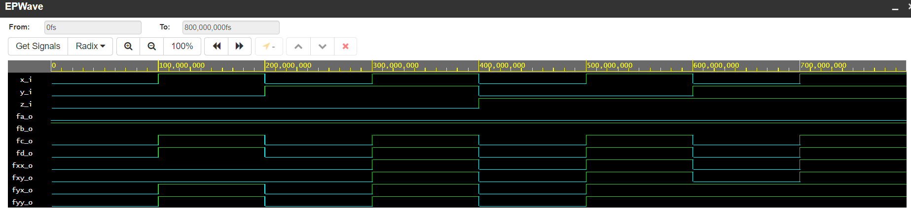

# CV-01-Gates

## Task 1

[Repository](https://github.com/Vitekmasa)

## Task 2
| **c** | **b** |**a** | **f(c,b,a)** |
| :-: | :-: | :-: | :-: |
| 0 | 0 | 0 | 1 |
| 0 | 0 | 1 | 1 |
| 0 | 1 | 0 | 0 |
| 0 | 1 | 1 | 0 |
| 1 | 0 | 0 | 0 |
| 1 | 0 | 1 | 1 |
| 1 | 1 | 0 | 0 |
| 1 | 1 | 1 | 0 |

[My code here](https://www.edaplayground.com/x/gzeu)

```VHDL
architecture dataflow of gates is
begin
    f_o  <= ((not b_i) and a_i) or ((not c_i) and (not b_i));
    fnand_o <= (a_i nand (not b_i)) nand ((not b_i) nand (not c_i));  
    fnor_o <= (a_i nor (not c_i)) nor b_i;

end architecture dataflow;
```


## Task 3
[My code here](https://www.edaplayground.com/x/9Et_)

```VHDL
architecture dataflow of gates is
begin
      fa_o <= x_i and (not x_i);
      fb_o <= x_i or (not x_i);
      fc_o <= x_i or  x_i  or  x_i  or  x_i;
      fd_o <= x_i and  x_i  and  x_i  and x_i;
      fxx_o <= (x_i and  y_i) or (x_i and  z_i);
      fxy_o <= x_i and (y_i or z_i);
      fyx_o <= ((x_i or y_i) and (x_i or z_i));
      fyy_o <= x_i or (y_i and  z_i);

end architecture dataflow;
```


