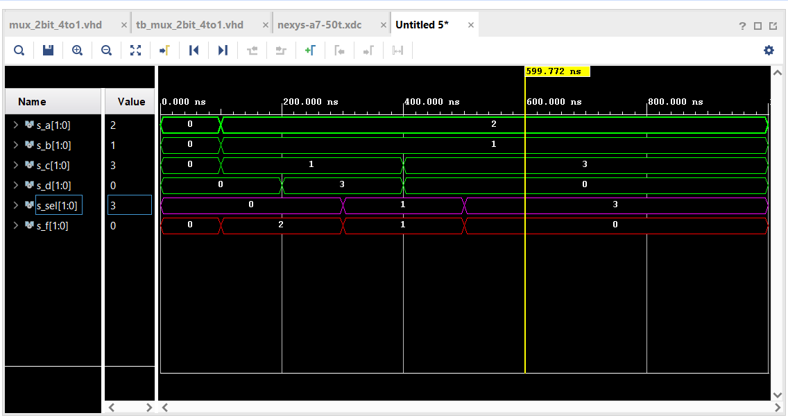

# CV-03-Vivado
[Repository](https://github.com/Vitekmasa)
## Task 1 (Preparation task)

| **c** | **b** |**a** | **f(c,b,a)** |
| :-: | :-: | :-: | :-: |
| 0 | 0 | 0 | 1 |
| 0 | 0 | 1 | 1 |
| 0 | 1 | 0 | 0 |
| 0 | 1 | 1 | 0 |
| 1 | 0 | 0 | 0 |
| 1 | 0 | 1 | 1 |
| 1 | 1 | 0 | 0 |
| 1 | 1 | 1 | 0 |

## Task 2
### VHDL architecture from mux_2bit_4to1
```VHDL
library ieee;
use ieee.std_logic_1164.all;

entity mux_2bit_4to1 is
    port(
        a_i           : in  std_logic_vector(2 - 1 downto 0);
		b_i           : in  std_logic_vector(2 - 1 downto 0);
        c_i           : in  std_logic_vector(2 - 1 downto 0);
        d_i           : in  std_logic_vector(2 - 1 downto 0);
        sel_i           : in  std_logic_vector(2 - 1 downto 0);
        -- COMPLETE ENTITY DECLARATION

        f_o    : out std_logic_vector(2 - 1 downto 0)
    );
end entity mux_2bit_4to1;

architecture Behavioral of mux_2bit_4to1 is
begin
    f_o    <= a_i when (sel_i = "00") else
              b_i when (sel_i = "01") else
              c_i when (sel_i = "10") else
              d_i;

end architecture Behavioral;
```
### VHDL stimulus process from tb_mux_2bit_4to1
```VHDL
architecture testbench of tb_mux_2bit_4to1 is

    -- Local signals
    signal s_a       : std_logic_vector(2 - 1 downto 0);
    signal s_b       : std_logic_vector(2 - 1 downto 0);
    signal s_c       : std_logic_vector(2 - 1 downto 0);
    signal s_d       : std_logic_vector(2 - 1 downto 0);
    signal s_sel     : std_logic_vector(2 - 1 downto 0);
    
    signal s_f       : std_logic_vector(2 - 1 downto 0);
    
begin
    uut_mux_2bit_4to1 : entity work.mux_2bit_4to1
        port map(
            a_i           => s_a,
            b_i           => s_b,
            c_i           => s_c,
            d_i           => s_d,
            sel_i         => s_sel,
            f_o            => s_f
        );
        
    p_stimulus : process
    begin
        report "Stimulus process started" severity note;

        s_a <= "00"; s_b <= "00";s_c <= "00"; s_d <= "00"; 
        s_sel <= "00";
        wait for 100 ns;
        
        s_a <= "10"; s_b <= "01";s_c <= "01"; s_d <= "00"; 
        s_sel <= "00";
        wait for 100 ns;
        
        s_a <= "10"; s_b <= "01";s_c <= "01"; s_d <= "11"; 
        s_sel <= "00";
        wait for 100 ns;
        
        s_a <= "10"; s_b <= "01";s_c <= "01"; s_d <= "11"; 
        s_sel <= "01";
        wait for 100 ns;
        
        s_a <= "10"; s_b <= "01";s_c <= "11"; s_d <= "00"; 
        s_sel <= "01";
        wait for 100 ns;
        
        s_a <= "10"; s_b <= "01";s_c <= "11"; s_d <= "00"; 
        s_sel <= "11";
        wait for 100 ns;

        report "Stimulus process finished" severity note;
        wait;
    end process p_stimulus;
end architecture testbench;
```
### Simulated time waveforms

## Task 3
[Toturial for Vivado](Toturial/Vivado_navod.pdf)
