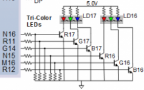
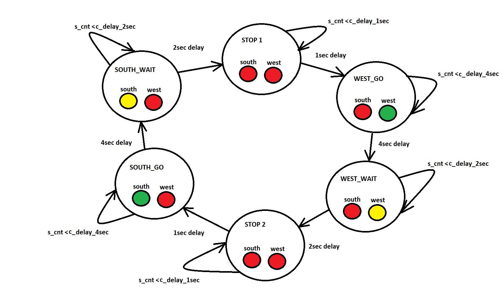
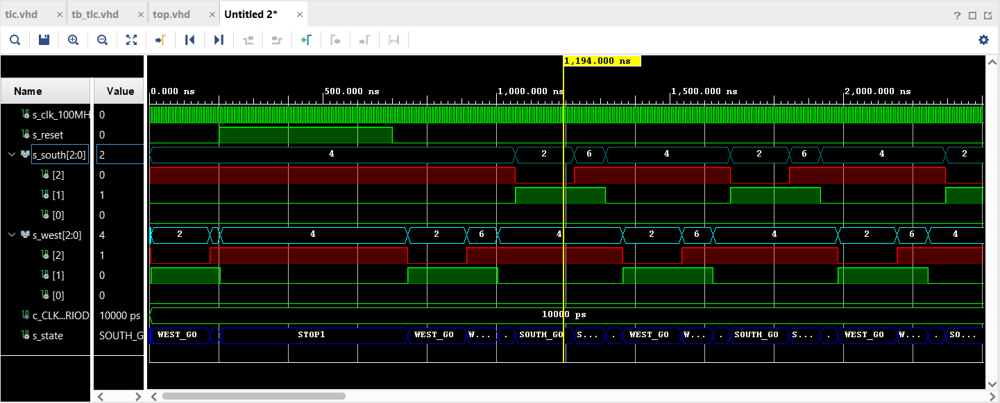
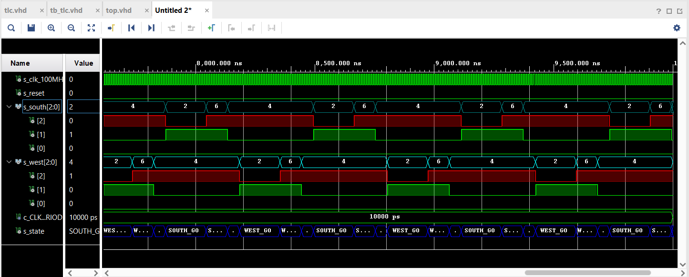
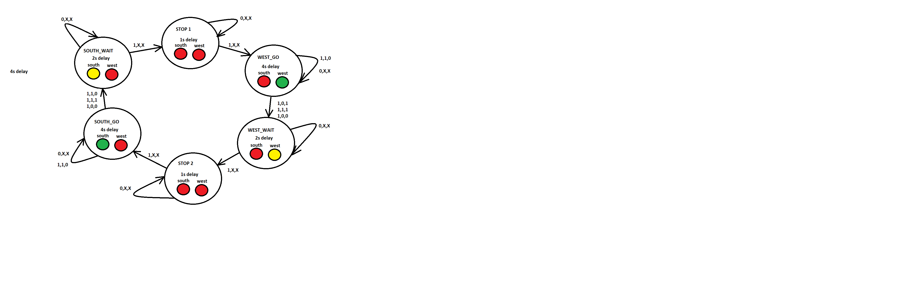

# CV-07-Latches and Flip-flops
[Repository](https://github.com/Vitekmasa)

## Task 1 (Preparation task)
### Characteristic equations for D, JK, T flip-flops
```vhdl
flip flops:
D: q_(n+1) = d
JK: q_(n+1) = j * (not q_n) + (not k) * q_n
T: q_(n+1) = t * (not q_n) + (not t) * q_n
```

### Characteristic table for D flip-flops
| **D** | **Qn** | **Q(n+1)** | **Comments** |
| :-: | :-: | :-: | :-- |
| 0 | 0 | 0 | No change |
| 0 | 1 | 0 | Change |
| 1 | 1 | 1 | No change |
| 1 | 0 | 1 | Change |

### Characteristic table for JK flip-flops
| **J** | **K** | **Qn** | **Q(n+1)** | **Comments** |
| :-: | :-: | :-: | :-: | :-- |
| 0 | 0 | 0 | 0 | No change |
| 0 | 0 | 1 | 1 | No change |
| 0 | 1 | 0 | 0 | Reset |
| 0 | 1 | 1 | 0 | Reset |
| 1 | 0 | 0 | 1 | Set |
| 1 | 0 | 1 | 1 | Set |
| 1 | 1 | 0 | 1 | Toggle |
| 1 | 1 | 1 | 0 | Toggle |

### Characteristic table for T flip-flops
| **T** | **Qn** | **Q(n+1)** | **Comments** |
| :-: | :-: | :-: | :-- |
| 0 | 0 | 0 | No change |
| 0 | 1 | 1 | No change |
| 1 | 0 | 1 | Toggle |
| 1 | 1 | 0 | Toggle |

## Task 2
### VHDL process of p_d_latch
```vhdl
    p_d_latch : process(d, arst, en)
    begin
        if (arst = '1') then
            q     <= '0';
            q_bar <= '1';
        elsif (en = '1') then
            q     <= d;
            q_bar <= not d;
        end if;
    end process p_d_latch;
```
### VHDL testbench processes of tb_d_latch
```vhdl
    p_reset_gen : process
    begin
        s_arst <= '0';
        wait for 50 ns;
        s_arst <= '1';
        wait for 10 ns;
        s_arst <= '0';
        wait for 108 ns;
        s_arst <= '1';

        wait;
    end process p_reset_gen;
    
    p_stimulus : process
    begin
        report "Stimulus process started" severity note;
        
        s_en    <= '0';
        s_d     <= '0';
        assert (s_q = '0' and s_q_bar = '1') report "Failed no. 1" severity note;
        
        wait for 10 ns;
        s_d    <= '1';
        wait for 10 ns;
        s_d    <= '0';
        wait for 10 ns;
        s_d    <= '1';
        wait for 10 ns;
        s_d    <= '0';
        wait for 10 ns;
        s_d    <= '1';
        wait for 10 ns;
        s_d    <= '0';
        wait for 10 ns;
        
        s_en <= '1';
        assert (s_q = '1' and s_q_bar = '0') report "Failed no. 2" severity note;
        
        wait for 10 ns;
        s_d    <= '1';
        wait for 10 ns;
        s_d    <= '0';
        wait for 10 ns;
        s_d    <= '1';
        wait for 10 ns;
        s_d    <= '0';
        wait for 10 ns;
        s_d    <= '1';
        wait for 10 ns;
        s_d    <= '0';
        wait for 10 ns;
        
        s_en <= '0';
        assert (s_q = '0' and s_q_bar = '1') report "Failed no. 3" severity note;
        
        wait for 10 ns;
        s_d    <= '1';
        wait for 10 ns;
        s_d    <= '0';
        wait for 10 ns;
        s_d    <= '1';
        wait for 10 ns;
        s_d    <= '0';
        wait for 10 ns;
        s_d    <= '1';
        wait for 10 ns;
        s_d    <= '0';
        wait for 10 ns;
        
        s_en <= '1';
        assert (s_q = '0' and s_q_bar = '1') report "Failed no. 4" severity note;
        
        wait for 10 ns;
        s_d    <= '1';
        wait for 10 ns;
        s_d    <= '0';
        wait for 10 ns;
        s_d    <= '1';
        wait for 10 ns;
        s_d    <= '0';
        wait for 10 ns;
        s_d    <= '1';
        wait for 10 ns;
        s_d    <= '0';
        wait for 10 ns;
        
        report "Stimulus process finished" severity note;
        wait;
    end process p_stimulus;
```
### Simulated time waveforms


## Task 3
### D flip-flop with async reset
#### VHDL process of d_ff_arst
```vhdl
    p_d_ff_arst : process(arst, clk)
    begin
        if (arst = '1') then
            q     <= '0';
            q_bar <= '1'; 
        elsif rising_edge(clk) then
            q     <= d;
            q_bar <= not d;
        end if;
    end process p_d_ff_arst;
```

#### VHDL process of tb_d_ff_arst
```vhdl
    p_clk_gen : process
    begin
        while now < 16ms loop         
            s_clk_100MHz <= '0';
            wait for c_CLK_100MHZ_PERIOD / 2;
            s_clk_100MHz <= '1';
            wait for c_CLK_100MHZ_PERIOD / 2;
        end loop;
        wait;
    end process p_clk_gen;
    
    p_reset_gen : process
    begin
        s_arst <= '0';
        wait for 58 ns;
        s_arst <= '1';
        wait for 15 ns;
        s_arst <= '0';

        wait;
    end process p_reset_gen;
    
    p_stimulus : process
    begin
        report "Stimulus process started" severity note;
        s_d     <=  '1';
        wait for 10ns;
        assert (s_q = '0' and s_q_bar = '1') report "Failed no. 1" severity note;
        
        s_d     <=  '0';
        wait for 10ns;
        assert (s_q = '1' and s_q_bar = '0') report "Failed no. 2" severity note;
        
        s_d     <=  '1';
        wait for 10ns;
        assert (s_q = '1' and s_q_bar = '0') report "Failed no. 3" severity note;
       
        s_d     <=  '0';
        wait for 10ns;
        assert (s_q = '0' and s_q_bar = '1') report "Failed no. 4" severity note;
        
        wait for 10ns;
        s_d     <=  '1';
        wait for 10ns;
        assert (s_q = '1' and s_q_bar = '0') report "Failed no. 5" severity note;
        report "Stimulus process ended" severity note;
        wait;
    end process p_stimulus;
```

#### Simulated time waveforms


### D flip-flop with sync reset
#### VHDL process of d_ff_rst
```vhdl
    p_d_ff_arst : process(clk)
    begin        
        if rising_edge(clk) then
            if (rst = '1') then
                q       <= '0';
                q_bar   <= '1';
            else
                q       <= d;
                q_bar   <= not d;
            end if;
        end if;
    end process p_d_ff_arst;

```
#### VHDL process of tb_d_ff_rst
```vhdl
utt_d_ff_rst : entity work.d_ff_rst
    port map(
        clk   => s_clk_100MHz,
        rst => s_rst,
        d    => s_d,
        q    => s_q,
        q_bar=> s_q_bar
    );

    p_clk_gen : process
    begin
        while now < 750 ns loop
            s_clk_100MHz <= '0';
            wait for c_CLK_100MHZ_PERIOD / 2;
            s_clk_100MHz <= '1';
            wait for c_CLK_100MHZ_PERIOD / 2;
        end loop;
        wait;
    end process p_clk_gen;
    
    p_reset_gen : process
    begin
        s_rst <= '0';
        wait for 12 ns;
        s_rst <= '1';
        wait for 30 ns;
        s_rst <= '0';
        wait;
    end process p_reset_gen;

    p_stimulus : process
    begin
       
        report "Stimulus process started" severity note;
        s_d     <=  '1';
        wait for 10ns;
        assert (s_q = '1' and s_q_bar = '0') report "Failed no. 1" severity note;
        
        s_d     <=  '0';
        wait for 10ns;
        assert (s_q = '0' and s_q_bar = '1') report "Failed no. 2" severity note;
        
        s_d     <=  '1';
        wait for 10ns;
        assert (s_q = '0' and s_q_bar = '1') report "Failed no. 3" severity note;
       
        s_d     <=  '0';
        wait for 10ns;
        assert (s_q = '0' and s_q_bar = '1') report "Failed no. 4" severity note;
        
        wait for 20ns;
        s_d     <=  '1';
        wait for 25ns;
        assert (s_q = '1' and s_q_bar = '0') report "Failed no. 5" severity note;
        
        report "Stimulus process ended" severity note;
        wait;
    end process p_stimulus;
```
#### Simulated time waveforms


### JK flip-flop (sync reset)
#### VHDL process of jk_ff_rst
```vhdl
architecture Behavioral of jk_ff_rst is
    signal  s_q     :   STD_LOGIC;
    signal  s_q_bar :   STD_LOGIC;
begin
    
    p_jk_ff_rst : process(clk)
    begin
        if rising_edge(clk) then
            if (rst = '1') then
                s_q         <=  '0';
                s_q_bar     <=  '1'; 
             else
                if (j = '0' and k = '0') then
                    s_q     <=  s_q;
                    s_q_bar <=  s_q_bar;
                elsif (j = '0' and k = '1') then
                    s_q     <=  '0';
                    s_q_bar <=  '1';
                elsif (j = '1' and k = '0') then
                    s_q     <=  '1';
                    s_q_bar <=  '0';
                else 
                    s_q     <=  not s_q;
                    s_q_bar <=  not s_q_bar;
                end if;
             end if;
        end if;
     end process p_jk_ff_rst;

     q       <=  s_q;
     q_bar   <=  s_q_bar;
   
end Behavioral;
```
#### VHDL process of tb_jk_ff_rst
```vhdl
utt_jk_ff_rst : entity work.jk_ff_rst
    port map(
        clk   => s_clk_100MHz,
        rst   => s_rst,
        j     => s_j,
        k     => s_k,
        q     => s_q,
        q_bar => s_q_bar
    );
    
     p_clk_gen : process
    begin
        while now < 750 ns loop
            s_clk_100MHz <= '0';
            wait for c_CLK_100MHZ_PERIOD / 2;
            s_clk_100MHz <= '1';
            wait for c_CLK_100MHZ_PERIOD / 2;
        end loop;
        wait;
    end process p_clk_gen;
    
    p_reset_gen : process
    begin
        s_rst   <= '0';
        wait for 100 ns;
        s_rst   <= '1';
        wait for 80 ns;
        s_rst   <= '0';
        wait;
    end process p_reset_gen;

    p_stimulus : process
    begin
        report "Stimulus process started" severity note;
        
        s_j <=  '1';
        s_k <=  '0'; 
        wait for 10ns;
        assert (s_q = '1' and s_q_bar = '0') report "Failed no. 1" severity note;
        
        s_j <=  '0';
        s_k <=  '1';
        wait for 10ns;
        assert (s_q = '0' and s_q_bar = '1') report "Failed no. 2" severity note;
        
        s_j <=  '1';
        s_k <=  '0';
        wait for 10ns;
        assert (s_q = '1' and s_q_bar = '0') report "Failed no. 3" severity note;
        
        s_j <=  '0';
        s_k <=  '1';    
        wait for 10ns;
        assert (s_q = '0' and s_q_bar = '1') report "Failed no. 4" severity note;
        
        s_j <=  '1';
        s_k <=  '1';
        wait for 10ns;
        assert (s_q = '1' and s_q_bar = '0') report "Failed no. 5" severity note;
        
        s_j <=  '1';
        s_k <=  '1';
        wait for 10ns;
        assert (s_q = '0' and s_q_bar = '1') report "Failed no. 6" severity note;
        
        s_j <=  '1';
        s_k <=  '1';
        wait for 10ns;        
        assert (s_q = '1' and s_q_bar = '0') report "Failed no. 7" severity note;
        
        s_j <=  '0';
        s_k <=  '0';
        wait for 10ns;
        assert (s_q = '1' and s_q_bar = '0') report "Failed no. 8" severity note;
        
        report "Stimulus process ended" severity note;
        wait;
    end process p_stimulus;
```
#### Simulated time waveforms


### T flip-flop wtih sync reset
#### VHDL process of t_ff_rst
```vhdl
architecture Behavioral of t_ff_rst is
    signal  s_q     :   STD_LOGIC;
    signal  s_q_bar :   STD_LOGIC;
begin

    t_ff_rst : process(clk)
    begin
        if rising_edge(clk) then
            if (rst = '1') then
                s_q         <=  '0';
                s_q_bar     <=  '1'; 
             else
                if (t = '0') then
                    s_q     <=  s_q;
                    s_q_bar <=  s_q_bar;
                else
                    s_q     <=  not s_q;
                    s_q_bar <=  not s_q_bar;
                end if;
             end if;
        end if;
    end process t_ff_rst;

    q       <=  s_q;
    q_bar   <=  s_q_bar;
end Behavioral;
```

#### VHDL testbench of tb_t_ff_rst
```vhdl
    uut_d_ff_arst : entity work.t_ff_rst
    port map (
        clk     =>  s_clk,
        t       =>  s_t,
        rst     =>  s_rst,
        q       =>  s_q,
        q_bar   =>  s_q_bar
    );
    
    p_clk_gen : process
    begin
        while now < 750 ns loop
            s_clk   <= '0';
            wait for c_CLK_100MHZ_PERIOD / 2;
            s_clk   <= '1';
            wait for c_CLK_100MHZ_PERIOD / 2;
        end loop;
        wait;
    end process p_clk_gen;
    
    p_reset_gen : process
    begin
        s_rst   <= '0';
        wait for 10 ns;
        s_rst   <= '1';
        wait for 10 ns;
        s_rst   <= '0';
        wait for 90 ns;
        s_rst   <= '1';
        wait for 50 ns;
        s_rst   <= '0';
        wait for 10 ns; 
        wait;
    end process p_reset_gen;

    p_stimulus : process
    begin
        report "Stimulus process started-" severity note;
        
        wait for 20 ns;
        s_t <=  '1';
        wait for 10ns;
        assert (s_q = '1' and s_q_bar = '0') report "Failed no. 1" severity note;
        
        s_t <=  '0';
        wait for 10ns;
        assert (s_q = '1' and s_q_bar = '0') report "Failed no. 2" severity note;

        s_t <=  '1';
        wait for 10ns;
        assert (s_q = '0' and s_q_bar = '1') report "Failed no. 3" severity note;
        
        s_t <=  '0';
        wait for 10ns;
        assert (s_q = '0' and s_q_bar = '1') report "Failed no. 4" severity note;
        
        s_t <=  '1';
        wait for 10ns;
        assert (s_q = '1' and s_q_bar = '0') report "Failed no. 5" severity note;
        
        s_t <=  '0';
        wait for 10ns;
        assert (s_q = '1' and s_q_bar = '0') report "Failed no. 6" severity note;
        
        report "Stimulus process ended" severity note;
        wait;
    end process p_stimulus;
```

#### Simulated time waveforms


## Task 4
### Schematic of register using D flip-flops

