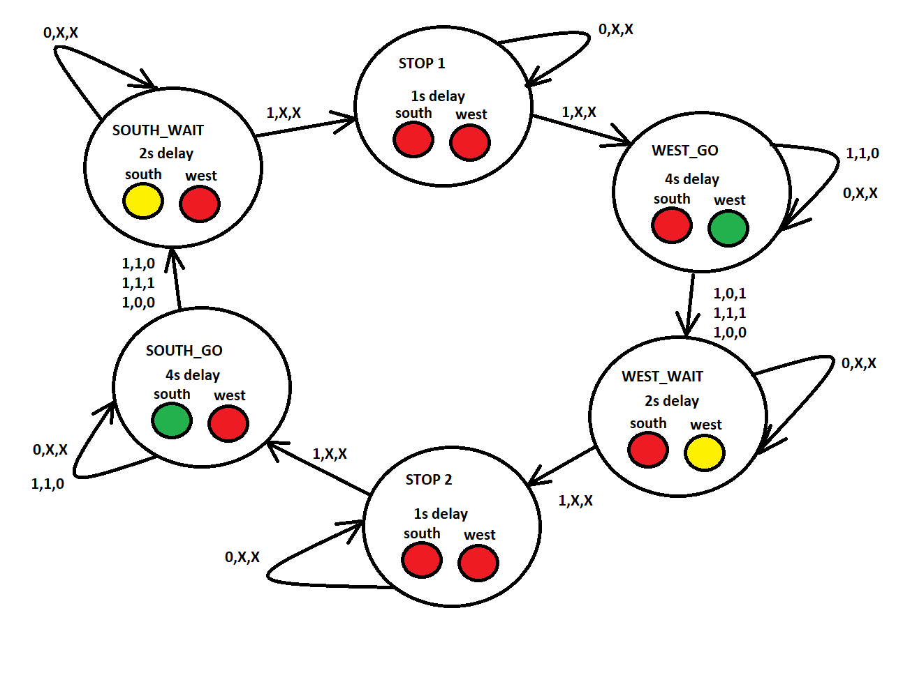

# CV-08-Traffic lights
[Repository](https://github.com/Vitekmasa)

## Task 1 (Preparation task)
### Completed state tabel
| **Input P** | `0` | `0` | `1` | `1` | `0` | `1` | `0` | `1` | `1` | `1` | `1` | `0` | `0` | `1` | `1` | `1` |
| :-- | :-: | :-: | :-: | :-: | :-: | :-: | :-: | :-: | :-: | :-: | :-: | :-: | :-: | :-: | :-: | :-: |
| **Clock** |  |  |  |  |  |  |  |  |  |  |  |  |  |  |  |  |
| **State** | A | A | B | C | C | D | A | B | C | D | B | B | B | C | D | B |
| **Output R** | `0` | `0` | `0` | `0` | `0` | `1` | `0` | `0` | `0` | `1` | `0` | `0` | `0` | `0` | `1` | `0` |

### Connection of RGB LEDs on Nexys A7 board


### Completed port table with color settings
| **RGB LED** | **Artix-7 pin names** | **Red** | **Yellow** | **Green** |
| :-: | :-: | :-: | :-: | :-: |
| LD16 | N15, M16, R12 | `1,0,0` | `1,1,0` | `0,1,0` |
| LD17 | N16, R11, G14 | `1,0,0` | `1,1,0` | `0,1,0` |

## Task 2
### State diagram for traffic lights


### VHDL sequential process of p_traffic_fsm
```vhdl
    p_traffic_fsm : process(clk)
    begin
        if rising_edge(clk) then
            if (reset = '1') then
                s_state <= STOP1 ; 
                s_cnt   <= c_ZERO;

            elsif (s_en = '1') then
            
                case s_state is

                    when STOP1 =>
                        if (s_cnt < c_DELAY_1SEC) then
                            s_cnt <= s_cnt + 1;
                        else
                            s_state <= WEST_GO;
                            s_cnt   <= c_ZERO;
                        end if;

                    when WEST_GO =>
                            if (unsigned(s_cnt) < c_DELAY_4SEC) then
                            s_cnt <= s_cnt + 1;
                        else
                            s_state <= WEST_WAIT;
                            s_cnt   <= c_ZERO;
                        end if;
                        
                    when WEST_WAIT =>
                        if (unsigned(s_cnt) < c_DELAY_2SEC) then
                            s_cnt <= s_cnt + 1;
                        else
                            s_state <= STOP2;
                            s_cnt   <= c_ZERO;
                        end if;
                        
                    when STOP2 =>
                        if (unsigned(s_cnt) < c_DELAY_1SEC) then
                            s_cnt <= s_cnt + 1;
                        else
                            s_state <= SOUTH_GO;
                            s_cnt   <= c_ZERO;
                        end if;
                        
                    when SOUTH_GO =>
                        if (unsigned(s_cnt) < c_DELAY_4SEC) then
                            s_cnt <= s_cnt + 1;
                        else
                            s_state <= SOUTH_WAIT;
                            s_cnt   <= c_ZERO;
                        end if;
                        
                    when SOUTH_WAIT =>
                        if (unsigned(s_cnt) < c_DELAY_2SEC) then
                            s_cnt <= s_cnt + 1;
                        else
                            s_state <= STOP1;
                            s_cnt   <= c_ZERO;
                        end if;
                    when others =>
                        s_state <= STOP1;

                end case;
            end if;
        end if;
    end process p_traffic_fsm;
```
### VHDL combinatoria processes of p_output_fsmsequential 
```vhdl
    p_output_fsm : process(s_state)
    begin
        case s_state is
            when STOP1 =>
                south_o <= c_RED;
                west_o  <= c_RED;
                
            when WEST_GO =>
                south_o <= c_RED;
                west_o  <= c_GREEN;
                
            when WEST_WAIT =>
                south_o <= c_RED;
                west_o  <= c_YELLOW;   
            
            when STOP2 =>
                south_o <= c_RED;
                west_o  <= c_RED;
                
            when SOUTH_GO =>
                south_o <= c_GREEN;
                west_o  <= c_RED;
                
            when SOUTH_WAIT =>
                south_o <= c_YELLOW;
                west_o  <= c_RED;                

            when others =>
                south_o <= c_RED;
                west_o  <= c_RED;
        end case;
    end process p_output_fsm;
```
### Start of simulated time waveforms


### End of simulated time waveforms


## Task 3
### Comleted state table
| **Current state** | **Direction South** | **Direction West** | **Delay** | **Input (counter_en, sensor_west, sensor_south)** |
| :-- | :-: | :-: | :-: | :-: |
| `STOP1`      | red    | red | 1 sec | n/c |
| `WEST_GO`    | red    | green | 4 sec | 1,1,0 or 0, X, X goto WEST_GO else goto WEST_WAIT |
| `WEST_WAIT`  | red    | yellow | 2 sec | n/c |
| `STOP2`      | red    | red | 1 sec | n/c |
| `SOUTH_GO`   | green  | red | 4 sec | 1,0,1 or 0, X, X goto SOUTH_GO else goto SOUTH_WAIT |
| `SOUTH_WAIT` | yellow | red | 2 sec | n/c |

### State digram


### VHDL sequential process of p_smart_traffic_fsm
```vhdl
p_traffic_fsm : process(clk)
    begin
        if rising_edge(clk) then
            if (reset = '1') then      
                s_state <= STOP1 ;     
                s_cnt   <= c_ZERO;      

            elsif (s_en = '1') then
                case s_state is
                    when STOP1 =>
                        if (s_cnt < c_DELAY_1SEC) then
                            s_cnt <= s_cnt + 1;
                        else
                            s_state <= WEST_GO;
                            s_cnt   <= c_ZERO;
                        end if;

                    when WEST_GO =>
                            if (s_cnt < c_DELAY_4SEC) then
                            s_cnt <= s_cnt + 1;
                        else
                            if (sens_w = '1' and sens_s = '0') then  
                                s_state <= WEST_GO;
                            else
                                s_state <= WEST_WAIT;
                            end if;
                            s_cnt   <= c_ZERO;
                        end if;
                        
                    when WEST_WAIT =>
                        if (s_cnt < c_DELAY_2SEC) then
                            s_cnt <= s_cnt + 1;
                        else
                            s_state <= STOP2;
                            s_cnt   <= c_ZERO;
                        end if;
                        
                    when STOP2 =>
                        if (s_cnt < c_DELAY_1SEC) then
                            s_cnt <= s_cnt + 1;
                        else
                            s_state <= SOUTH_GO;
                            s_cnt   <= c_ZERO;
                        end if;
                        
                    when SOUTH_GO =>
                        if (s_cnt < c_DELAY_4SEC) then
                            s_cnt <= s_cnt + 1;
                        else
                           if (sens_w = '0' and sens_s = '1') then  
                                s_state <= SOUTH_GO;
                            else
                                s_state <= SOUTH_WAIT;
                            end if;
                            s_cnt   <= c_ZERO;
                        end if;
                        
                    when SOUTH_WAIT =>
                        if (s_cnt < c_DELAY_2SEC) then
                            s_cnt <= s_cnt + 1;
                        else
                            s_state <= STOP1;
                            s_cnt   <= c_ZERO;
                        end if;
                    when others =>
                        s_state <= STOP1;

                end case;
            end if;
        end if;
    end process p_traffic_fsm;
```
